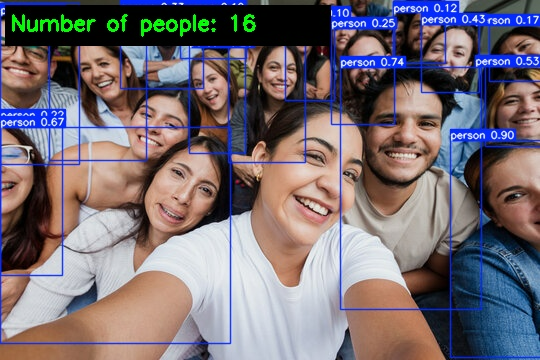
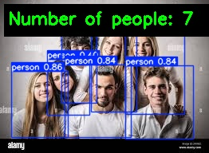

# Crowd Density Detection System using YOLOv5

## 📌 Overview

This project is a Crowd Density Detection System built using YOLOv5.
It detects people in images, videos, or live webcam feeds and displays the total number of people detected in real time.

The project focuses on real-time performance, simplicity, and practical usage rather than complex crowd estimation models.

## 🎯 Purpose of the Project

- The main goal of this project is to:
- Detect people in crowded scenes
- Count the number of people automatically
- Display bounding boxes and total count on the output frame

- This system can be useful in:

 Crowd monitoring
 Public safety
 Event management
 Surveillance applications

## 🧠 Why YOLOv5?

YOLOv5 is used because:
- It is fast and lightweight
- Works well for real-time detection
- Easy to deploy on CPU systems
- Suitable for beginners and practical projects

Note: This project uses object detection–based counting, not density-map based counting. Hence, heavily crowded or occluded scenes may show a lower count.

## 🛠️ Tech Stack
- Python 3.8
- YOLOv5 (YOLOv5s)
- PyTorch
- OpenCV
- NumPy
- Anaconda
- VS Code

## ✨ Features
- Real-time crowd detection
- Accurate people counting
- Works on images, videos, and webcam
- Displays bounding boxes around detected persons
- Shows total number of people on the output frame
- Lightweight and fast inference using YOLOv5
- Adjustable confidence threshold and box thickness

Runs on CPU

## 📂 Project Structure
Crowd-Density-Detection-System/
├── assets/                       # Output screenshots
│   ├── output1.png
│   └── output2.png
│
├── data/                         # Input images
│   └── images/
│       ├── grp.jpg
│       └── bus.jpg
│
├── weights/                      # YOLOv5 pretrained weights
│   └── yolov5s.pt
│
├── yolov5/                       # Detection codebase
│   ├── detect.py
│   ├── models/
│   ├── utils/
│   └── runs/
│       └── detect/
│           ├── exp/
│           └── exp2/
│
├── requirements.txt
└── README.md

## ▶️ How to Run
1️⃣ Activate Environment
conda activate crowd

2️⃣ Run on Image
python detect.py --weights yolov5s.pt --source data/images/grp.jpg

3️⃣ Run on Webcam
python detect.py --weights yolov5s.pt --source 0

## 📊 Output

Bounding boxes around detected people

Text on frame:
Number of people: X

### 🖼️ Sample Outputs

**Image 1 – Crowd Detection**

**Image 2 – Crowd Detection**

All detection results are automatically saved in:

runs/detect/

